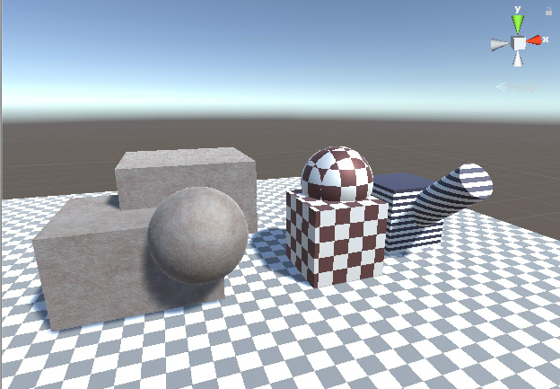
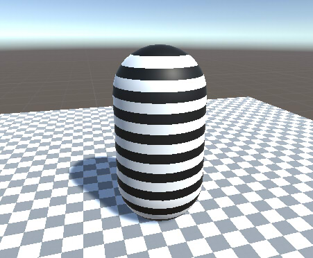
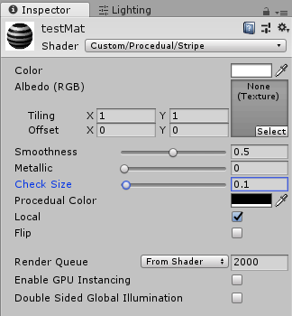
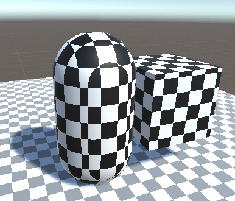
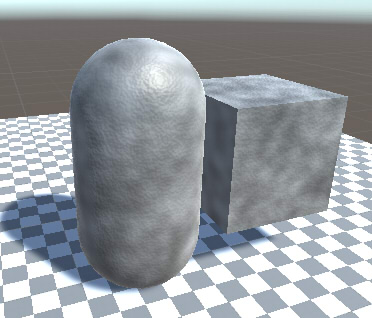
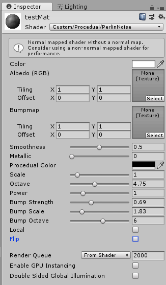

# Procedual Texture in Unity

UnityでProcedual Texture表現を行うShaderです。    
    
Procedual Textureとは、Solid Textureとも呼ばれる、
3次元空間の座標値にてマッピングを行うテクスチャです。    
UVを指定していなくてもテクスチャを貼ることができます。    

ご自由にご自分のShader/Materialに組み込んだり改造したりしてご使用くださいませ。    

## 開発環境

Unity 2018.2.12f1 (Windows)

Macは未確認です。    

## 機能

Shaderとして、以下のProcedual Textureを作成しました。    

* Stripe
* Check
* Perlin Noise

### Stripe

Y軸方向に縞模様をマッピングします。    
    
MaterialのShaderとして「Custom/Procedual/Stripe」を指定します。    
    

「Check Size」で縞模様の間隔をメートル単位で指定します。    
「Procedual Color」のRGBで模様の色を指定、Aが反映の強さです。    
「Local」チェックボックスをオンにすると、ローカル座標でマッピングします。    
この場合は、形状が移動/回転しても模様は追従します。    
オフにすると、ワールド座標でマッピングします。    
「Flip」チェックボックスをオンにすると、マッピング色を反転します。    

### Check

XYZ軸方向にチェック模様をマッピングします。    
    
MaterialのShaderとして「Custom/Procedual/Check」を指定します。    
    

「Check Size」でチェック模様の間隔をメートル単位で指定します。    
「Procedual Color」のRGBで模様の色を指定、Aが反映の強さです。    
「Local」チェックボックスをオンにすると、ローカル座標でマッピングします。    
この場合は、形状が移動/回転しても模様は追従します。    
オフにすると、ワールド座標でマッピングします。    
「Flip」チェックボックスをオンにすると、マッピング色を反転します。    

### Perlin Noise

ノイズ模様をマッピングします。    
色とバンプを指定できます。    
    
MaterialのShaderとして「Custom/Procedual/PerlinNoise」を指定します。    
    

「Procedual Color」のRGBで模様の色を指定、Aが反映の強さです。    
「Scale」でノイズ模様の大きさを指定します。    
「Octave」でノイズ模様の重ね合わせの数を指定します。    
「Power」でノイズ模様の値をpow(Value, Power)として強調します。    

「Bump Strength」でバンプマップとしての強さを指定します。    
0を指定するとバンプは無効になります。    

「Bump Scale」でバンプのノイズ模様の大きさを指定します。    
「Bump Octave」でバンプのノイズ模様の重ね合わせの数を指定します。    

「Local」チェックボックスをオンにすると、ローカル座標でマッピングします。    
この場合は、形状が移動/回転しても模様は追従します。    
オフにすると、ワールド座標でマッピングします。    
「Flip」チェックボックスをオンにすると、マッピング色を反転します。    

## ライセンス  

This software is released under the MIT License, see [LICENSE](./LICENSE).  

## 更新履歴

[2018/12/09]    
* 初回版

