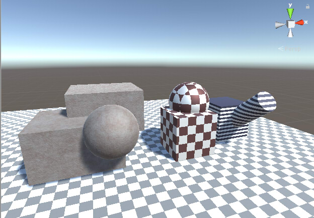
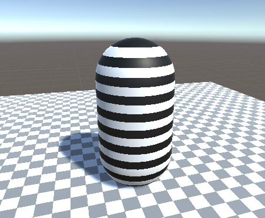
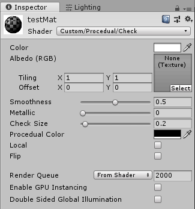
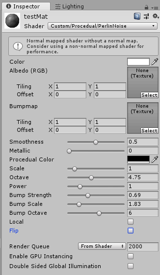

# Procedual Texture in Unity

It translated by google translation.    

This is Shader of Procedual Texture at Unity.    
    
Procedural Texture is a technique called Solid Texture,
It is a texture mapping from the coordinate values in 3D space.    
Texture can be pasted even if UV is not specified.    

Please freely incorporate it into your Shader / Material or modify it and use it.    

## Development environment

Unity 2018.2.12f1 (Windows)

Mac is unidentified...    

## Function

As Shader, I created the following procedural texture.    

* Stripe
* Check
* Perlin Noise

### Stripe

Map the striped pattern in the Y axis direction.    
    
Specify "Custom/Procedural/Stripe" as Material Shader.    
    

"Check Size" specifies the stripe interval in meters.    
RGB of "Procedural Color" designates the color of the pattern, and A is the strength of influence.    
By checking the "Local" checkbox, you map by local coordinates.    
In this case, even if the shape moves / rotates, the pattern will follow.    
When it is turned off, it maps in world coordinates.    
Turning on the "Flip" checkbox will invert the mapping color.    

### Check

Map the check pattern in the XYZ axis direction.    
    
Specify "Custom/Procedural/Check" as Material Shader.    
    
"Check Size" specifies the check pattern interval in meters.    
RGB of "Procedural Color" designates the color of the pattern, and A is the strength of influence.    
By checking the "Local" checkbox, you map by local coordinates.    
In this case, even if the shape moves / rotates, the pattern will follow.    
When it is turned off, it maps in world coordinates.    
Turning on the "Flip" checkbox will invert the mapping color.    

### Perlin Noise

Map the noise pattern.    
You can specify colors and bumps.    
    
Specify "Custom/Procedural/PerlinNoise" as Material Shader.    
    

RGB of "Procedural Color" designates the color of the pattern, and A is the strength of influence.    
"Scale" specifies the size of the noise pattern.    
"Octave" specifies the number of overlapping noise patterns.    
"Power" emphasizes the noise pattern value as pow (Value, Power).    
"Bump Strength" specifies the strength as a bump map.    
If 0 is specified, bumps are invalidated.    

"Bump Scale" specifies the size of the noise pattern of bump.    
"Bump Octave" specifies the number of overlapping noise patterns of bump.    

By checking the "Local" checkbox, you map by local coordinates.    
In this case, even if the shape moves / rotates, the pattern will follow.    
When it is turned off, it maps in world coordinates.    
Turning on the "Flip" checkbox will invert the mapping color.    

## License  

This software is released under the MIT License, see [LICENSE](./LICENSE).  

## Change log

[2018/12/09]    
* first version

